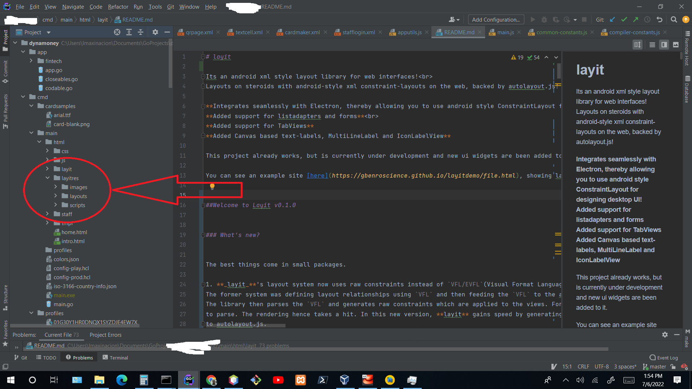

# layit

Its an android xml style layout library for web interfaces!<br>
Layouts on steroids with android-style xml constraint-layouts on the web, backed by autolayout.js!

**Integrates seamlessly with Electron, thereby allowing you to use android style ConstraintLayout for designing desktop UI!**<br>
**Added support for listadapters and forms**<br>
**Added support for TabViews**
**Added Canvas based text-labels, MultiLineLabel and IconLabelView**

This project works, and is under continuous development as new ui widgets are being added to it.

You can see an example site [here](https://gbenroscience.github.io/layitdemo/file.html), showing layit being used to position things with ease(ignore the design, please)


## Welcome to Layit v0.1.4


### What's new?

As of release tag **_v0.1.4_**, `layit` now supports single page applications. 
Specify `data-pageType="spa"` on the script tag that loads `layit.js` in your html file. 
It takes 2 values: `"spa"` or `"mpa"`. If you do not specify the `data-pageType` attribute, it defaults to "mpa": i.e. the normal usage. When in `spa` mode, use the global `goToView('view_name.xml')` function to switch to various workspaces. Preload those workspaces if you will by using the `data-pages` attribute on the script tag that loads `layit.js`.
This will look like: `data-pages="index.xml,login.xml,register.xml,dashboard.xml"` etc.
   `onResume` and `onPause` callbacks have been added for the sake of `SPAs`. When you switch to a `ViewController`, the `onResume` callback is fired. When you switch to another, the `onPause` callback is fired on the one we are moving away from.


The best things come in small packages.

1. **_layit_**'s layout system now uses raw constraints instead of `VFL/EVFL`(Visual Format Language/Extended Visual Format Language).
The former system was defining layout relationships using `VFL` and then feeding the `VFL` to the autolayout library.
The library then parses the `VFL` and generates raw constraints which are applied to the views. For complex layouts, this means that the library generate lots of `VFL` strings which the underlying autolayout library would then need
to parse. The rendering hence takes a hit. In this new version, **layit** gains speed by generating raw constraints from the xml layouts, which are then passed
to autolayout.js.

2. The folder structure has been changed to fit better with project development structure realities. 
   The former structure had both user files and library files in the same folder which wasn't efficient when the library would need to be updated from the VCS.
   Now, all the developer needs to do is create a folder for their resources called _**layitres**_ as a sibling folder of(in same directory as) the _**layit**_ library folder.
   Copy your layouts, images and scripts folder to that folder. That's it. If the developer is careful enough,
   they can change the default name of the folder from _**layitres**_ to whatever they want. 
   To do this, go into the _**layit**_ folder and find the common-constants file in the _**sys**_ folder.
   Now, find the constant named: _**RESOURCES**_, then change the value to whatever you have named your folder as.
   The folder structure for using _**layit**_ in a project will look like:
   
    
3. Because of Point 1 above, we have flexibility to make the library more powerful. Guidelines work better now,also we have implemented 
   priorities on the width, height and the constraint properties, such as `start_start`,  `end_end`, `start_end`, `end_start`, top_top, `bottom_bottom`, `top_bottom`, `bottom_top`,
   `cx_align` and `cy_align`. Specifying the priority is totally optional. If you do not specify it, a priority of `REQUIRED` or `1000` is assumed.
   To specify it on any property, just use the: `property="value@priority"` syntax
   So for instance: `width="20px@1000"` or `height="width@750"` or `start_start="some_id@251"`. The priority definitions follow iOS Autolayout rules.


You can achieve very complex layouts very quickly using constraints. In addition, we adopted the cool xml style of Google's android xml layouts which allow you build layouts very quickly instead of the weird but _**powerful?**_ syntax of VFL and EVFL.
To make things even sweeter, we have changed the long names given to the constraint properties in the android xml syntax, to much shorter versions to allow for quick typing and to reduce bloat, e.g: `app:layout_constraintBottom_toBottomOf="parent"` becomes: `bottom_bottom='parent'`

### NOTE: Some of the more advanced constraint properties in Android xml's ConstraintLayout are not yet supported, such as chaining, layout weight.
## Usage

You need the entire project folder, so clone this repository and place it(the `layit` folder) in the root of your web project.<br>
When you create a `html` file in your web project, depending on your code organization, it should look like this:
```html
<html>
    <head>
        <title>TODO supply a title</title>
        <meta charset="UTF-8">
        <meta name="viewport" content="width=device-width, initial-scale=1.0">
        <script type="text/javascript" src="correct/path/to/layit.js" data-launcher="test.xml"></script>

        
    </head>
    <body>
<!--        <div>HAAAI!!!! MAIIIIY PIPUULLL!!!</div>-->
    </body>
</html>
```
This fetches an xml layout called `test.xml` from the `layouts` sub-folder in your `layitres` folder and use it as the ui definition for the current html page.


### Layouts
All your xml layouts must be placed in the `layitres/layouts` folder. If you have changed the location of the _**resources**_ folder,
You should use that folder name<br>
No sub-folders are allowed here.
All your view tags, with the exception of the root view tag in the xml must have an `id`

A layout file must begin with a root element, called a `ConstraintLayout` element.
This root element is later translated into a `div` anyway, if you care to know.
Any `<View />` tag is also translated into a div later on.

With this library and similar libs, we are looking at the days of flatter layouts in web ui technologies, just as happened on mobile devices.
Nested layouts can only result if the user decides to use included files, as these are translated and laid out in their own div, before their parent div is appended into the including div(The div generated from the `<include />` tag.)

The file would look like this:

```xml
<?xml version="1.0" encoding="utf-8"?>
<ConstraintLayout
    width="match_parent"
    height="match_parent">

     <View
        id="section_top"
        width="match_parent"
        height="128px"
        backgroundColor="#000044"
        top_top='parent'
        start_start='parent'
        end_end='parent'

    />
    <Label
        id="site_title"
        width="wrap_content"
        height="wrap_content"
        start_start='section_top'
        cy_align="section_top"
        marginStart="16"
        textColor="#eee"
        value="Layit Framework By Example"
        textSize="1.5em"
        textStyle="bold italic"
        fontFamily="Kartika"
    
    />
  
    <!--- ...Other xml tags -->
</ConstraintLayout>    
```


### Layout Construction & Syntax in more detail
The syntax of your xml file is basically same as that of Android's xml.
The constraint properties with long names have been renamed to shorter forms to allow for quicker typing and other advantages, e.g:

```
    layout_constraintTop_toTopOf       -> top_top
    layout_constraintBottom_toBottomOf -> bottom_bottom
    layout_constraintStart_toStartOf   -> start_start
    layout_constraintEnd_toEndOf       -> end_end
    layout_constraintTop_toBottomOf    -> top_bottom
    layout_constraintStart_toEndOf     -> start_end
    layout_constraintEnd_toStartOf     -> end_start
    layout_constraintBottom_toTopOf    -> bottom_top
    layout_constraintCenterXAlign      -> cx_align
    layout_constraintCenterYAlign      -> cy_align
    layout_constraintDimensionRatio    -> dim_ratio
    layout_constraintGuide_percent     -> guide_percent(in %)
    layout_constraintGuide_begin     -> guide_begin(in px or no units)
    layout_constraintGuide_end     -> guide_end(in px or no units)
```

#### width and height

These properties are used to specify the size of the view. 
Here are perfectly valid ways to specify the width of a view:
```
1. width="80px"  //sets the width in pixels
2. width="50%"   // sets the width as a percentage of its parent's width
3. width="80"    //sets the width in pixels
4. width="height" // sets the view's width to be same as its height
5. width="height*0.5" //sets the view's width to be half of its height
6. width="0.5*height" //sets the view's width to be half of its height
7. width="some_id" // sets the view's width to be same as that of the view whose id is `some_id`
8. width="some_id.width" // sets the view's width to be same as that of the view whose id is `some_id`
9. width="some_id.height" // sets the view's width to be same as the height of the view whose id is `some_id`
10. width="0.8*some_id" // sets the view's width to be 0.8 times the width of `some_id`
11. width="0.3*some_id.width"// sets the view's width to be 0.3 times the width of `some_id`
12. width="0.8*some_id.height"// sets the view's width to be 0.8 times the height of `some_id`
13. width="some_id.width*0.3"// sets the view's width to be 0.3 times the width of `some_id`
14. width="some_id.height*0.8"// sets the view's width to be 0.8 times the height of `some_id`
15. width="12+height" // sets the view's width to be 12 plus its own height
16. width="height+20" // sets the view's width to be 20 plus its own height
17. width="height-12" // sets the view's width to be its own height minus 12
18. width="96+some_id.width"// sets the view's width to be 96 pixels plus the width of `some_id`
19. width="32+some_id.height"// sets the view's width to be 32 pixels plus the height of `some_id`
20. width="some_id.width+120"// sets the view's width to be 120 pixels plus the width of `some_id`
21. width="some_id.height+32"// sets the view's width to be 32 pixels plus the height of `some_id`
22. width="some_id.width-120"// sets the view's width to be the width of `some_id` minus 120 pixels
23. width="some_id.height-32"// sets the view's width to be the height of `some_id` minus 120 pixels
```
These same rules apply to the height also. Note that division operation is not supported, only multiplication, addition and subtraction.

Be careful not to use values which have not been initialized.
e.g.
width="height" is correct, but
width="width+20" is wrong

Also make sure that `some_id` is a different view from the one whose size we are setting or if it is the same view, 
then it should refer to the other dimension.
For example, if the view whose size we are setting is `phone_label`, You may do:
width="phone_label.height"
but not:
width="phone_label.width" or width="phone_label.width*2" or something similar.

If you are setting the width in terms of the height or the height in terms of the width, then ensure that you have properly
defined the value of the other dimension e.g.

`width="height"`<br>
`height="90px"`<br>

OR

`width="height"`<br>
`height="some_id"`<br>

All these relationships help to define aspect ratios and more complicated relationships that give developers flexibility in building UI.

`width='match_parent'` and `height='match_parent'` are supported.
`width='wrap_content'` and `height='wrap_content'` are only partially supported. 
The implementation is not yet complete as regards these, for various reasons.

The underlying `autolayout.js` library does not seem to support `wrap_content`,so we are trying to provide some implementation for it.

Note that where no units are specified, pixels are used. So `width='200'` and `width='200px'` are equivalent.
All these apply to `height` also.<br>
**CSS calc operations are not supported**<br>

#### maxWidth and maxHeight , minWidth and minHeight 
These are all supported.

#### margins

Negative margins are not supported! The units supported for margins are pixels and percentages. 
If no units are supplied, pixels are assumed.
    

#### cx_align and cy_align

Allows a view's center to be constrained horizontally or vertically to another view's center.<br>
The values accepted are either, `parent` or `view_id`; where `view_id` is the id of the view we are constraining this view with respect to.


#### Includes
Sub layouts can be included in a layout up to several levels. Just use the <include/> tag and specify the layout to be included. e.g:
```xml
 <include
        layout="includer"
        id="included_details"
        width="100%"
        height="220"
        marginTop="12px"
        cx_align="parent"
        top_bottom="some_view"
        border="1px solid lightgray"
        borderRadius="1em"
    />
```

The above tag specifies that a div should be created and assigned the identity: `included_details`. The xml layout in the file called `includer.xml` should be rendered within this div. It should be horizontally aligned with its parent center and its top should be constrained to the bottom of a view whose id is `some_view` in the same xml file. The other properties are injected into the stylesheet for the page.<br><br>

### imports: Loading scripts to control your ui elements

**`imports`** are an important feature introduced here. They allow the library dynamically load scripts that the user wishes to use in working with the xml ui; e.g. a controller.

To import scripts, use the imports tag as such:

```xml
<?xml version="1.0" encoding="utf-8"?>
<ConstraintLayout
    width="match_parent"
    height="match_parent">

    <imports
        files="aa/aaa.js;mm/mmm.js;" controller="controller_name"
    />
    
    <!--- ...Other xml tags -->
</ConstraintLayout>    
```
This will load the files `aaa.js` and `mmm.js` in the directories `aa` and `mm` respectively; where the directories `aa` and `mm` are both located in the `scripts` directory of the `layitres` folder.<br>
Your ui scripts should be defined in the `scripts` directory. You may create folders and subfolders within the `scripts` directory


Define an `imports` tag anywhere in the root xml layout and the library will load the scripts defined in the `imports` tag.<br>
This allows you to separate your ui(the xml layout) from its logic and other related logic.


Each xml layout cannot have more than one `ViewController` and that must be defined in the root xml file

The library allows you to define at most one viewcontroller per xml layout. Specify the name of the viewcontroller in the controller attribute of the `imports` tag.
Your controller must be defined in one of the files that you have imported in the `files` attribute of the `imports` tag.

#### ViewControllers

A `ViewController` is a standard way of interacting with your UI from code.
Your view controller must inherit from the base `ViewController` class of the library.

The minimum code to do this is:

Say you have created your `ViewController class` in the `scripts` folder; let's say its name is `TestController` in a file called `test.js`.


```Javascript
/* global ViewController */

TestController.prototype = Object.create(ViewController.prototype);
TestController.prototype.constructor = TestController;

function TestController(workspace){
    ViewController.call(this, workspace);
}


/**
 * Don't try to access your views here please.
 * The views may or may not be ready yet! 
 * This only signifies that your ViewController has been created.
 * @param {Workspace} wkspc The workspace
 * @returns {undefined}
 */
TestController.prototype.onCreate = function(wkspc){
     ViewController.prototype.onCreate.call(this, wkspc);
//Your code goes below here
};


/**
 * Your views are ready to use...
 * But there is no guarantee that all scripts have been loaded!
 * So DONT!
 * @param {string} wid The workspace id
 * @returns {undefined}
 */
TestController.prototype.onViewsAttached = function(wid){
   ViewController.prototype.onViewsAttached.call(this, wid);
};

/**
 * All scripts have loaded. By observation, all your views too
 * have loaded, but proceed at your own risk.
 * Your code is 100% safe to use only in onViewsReady
 * @param {Workspace} wkspc The workspace
 * @returns {undefined}
 */
TestController.prototype.onScriptsReady = function(wkspc){
   ViewController.prototype.onScriptsReady.call(this, wid);
};

/**
 * All scripts and views have fully loaded!
 * Write stuff to your heart's content here...
 * @param {Workspace} wkspc The workspace
 * @returns {undefined}
 */
TestController.prototype.onViewsReady = function(wkspc){
   ViewController.prototype.onViewsReady.call(this, wkspc);
//Your code goes below here

//e.g let view = this.findHtmlViewById('site_title');


};

```

For now, the `ViewController` has only 2 implemented lifecycle methods; these are:
`onCreate` and `onViewsAttached`.

1. `onCreate` is fired when the ViewController has been successfully instantiated by the JS runtime. Do not try to access your UI Elements within this method!
   They may or may not be created yet!
2. `onViewsAttached` This is fired when all your ui elements have been successfully created and attached to the `DOM`. You may freely access them from within this method.
3. `onScriptsReady` This is fired when all the scripts imported in your xml have been loaded.
4. `onViewsReady` This is fired when `layit`  is done building your UI and loading all scripts. You may fully interact with your UI and your scripts here.

Your `ViewController` has also inherited some methods from the base viewcontroller which it may use to locate html elements in the DOM.

From within your `onViewsAttached` method or a method called from within that method, you may call: `this.findHtmlViewById(elementId)` to select a html element, and then use it in your code.

**_More methods will be added as needed_**

Now add this view controller to your xml layout, like this:

```XML
<?xml version="1.0" encoding="utf-8"?>
<ConstraintLayout
    width="match_parent"
    height="match_parent">

    <imports
        files="test.js;networking.js;" controller="TestController"
    />
    
    <!--- ...Other xml tags -->
</ConstraintLayout>
```


## Workspace

To load an xml file, the library uses the concept of a `Workspace`. A workspace is a Javascript class which on its own is able to completely process an xml layout of valid syntax into a html document suitably laid out using autolayout technology. It has the ability to identify all included xml layouts, and load and process them also.

The `Workspace` constructor takes an `options` parameter which has 4 or 5 fields, depending on what you wish to achieve.


### Anatomy of the `options` object

```Javascript
let options =  {
 layoutName: 'layout.xml',
 bindingElemId: 'id_of_element_layout_will_be_attached_to',
 templateData:  'A json object that can be used to parse values into the xml layouts.. this allows for templating',
 xmlContent: 'You do not wish to load the xml from the supplied layout name. So supply the xml here directly',
 onComplete: 'A function to run when the layout has been parsed and loaded'
 }
```

If you wish to load the xml layout from a file, then specify the file name (as it is in your layouts folder), using the `options.layoutName` field and **DO NOT** specify the`options.xmlContent` field at all.

If you already have the xml content that you want to render, then the `Workspace` will still require you to supply a dummy but **UNIQUE** file name on `options.layoutName`.
It needs to be a unique name which you assign to this `Workspace` so the library can use it to generate an id for the `Workspace` when it caches it.
Then supply the xml layout to the `options.xmlContent` field.


The `options.bindingElemId` field is the id of an existing(already existing in the DOM) html element. When the xml layout is loaded and parsed into HTML, the parsed layout will be attached to the element whose id is `bindingElemId`.


### Create the `Workspace`

To create the `Workspace`, do:

```Javascript
let workspace = new Workspace(options);
```

In some cases, you will want to do:

```Javascript
let workspace = getWorkspace(options);
```

The `Workspace's` work is done within its constructor, but if for some reason you need a reference to the `Workspace` after it has been created, then you may use the `getWorkspace(options)` function.
The function `getWorkspace(options)` is a global function that will be available from all files. It checks if a `Workspace` defined by the supplied `options` has been previously created. If so, it loads it from the cache, else it creates a new `Workspace` object and returns it.

The `Workspace` object is what owns the `ViewController` class which you can use to interact with the layout loaded by the `Workspace`.

The `Workspace` is a pretty powerful tool as far as the library goes. It is what loads and parses the xml layout whether from files or generated dynamically and creates the html layout from it. It also controls the loading of the ViewController from the xml and is responsible for firing its lifecycle methods.

If you wish to load an xml layout and attach it to the body of the page, e.g. your layout is to be the html page, then the `bindingElemId` field of the `options` object used to create the Workspace must be set to: `BODY_ID` ...e.g:

```Javascript
let options =  {
 layoutName: 'layout.xml',
 bindingElemId: BODY_ID,
 onComplete: function(rootView){
     //'Code to run when the layout has been parsed and loaded'
   }
 }
```
`BODY_ID` is a predefined constant and is globally available.

If you have a `div` or some other html element that you wish to load the parsed xml layout into, then set the html element's id into the `options` object and the view should load on the element just fine.<br><br>

### NOTE: We have changed the default root element from `document.body` to a root div on `document.body`, since we learnt the hard way that libs like SweetAlert will display at the back of the layout if we make `document.body` the default parent element.
The `BODY_ID` field still exists however and will still be the id of the root div.


### XML Templates

To make the library more useful, especially with server-side technologies, we support templating with the xml layouts.
Developers will mainly need templates when assigning values to the attributes of nodes in the layout.

_**Note** we use [Mustache](https://github.com/janl/mustache.js)_ for xml templates.


The `options.templateData` field takes a Javascript object which can be used to pass templating information to the xml layout.
Also, if you are loading the `Workspace` from the html page's script tag, you can use the `data-template` attribute to specify the template data to apply to your xml layouts. e.g:

```html
<html>
    <head>
        <title>TODO supply a title</title>
        <meta charset="UTF-8">
        <meta name="viewport" content="width=device-width, initial-scale=1.0">
        <script type="text/javascript" src="correct/path/to/layit.js" data-launcher="test.xml" data-template='{"name":"Developer Africanus"}'></script>

        
    </head>
    <body></body>
</html>
```

Note how we apply the json string to the `data-template` attribute.

So, from your backend you may encode your template data as a json string and apply it to the `data-template` attribute of the script tag. 
Since json may look a bit awkward in that tag, you could specify the `data-type` attribute and set its value as `json-b64`(i.e. json encoded as `base64`.)
Then of course, set base64 coded json in the `data-template` field. 
<b>NOTE:</b> when unspecified, this library assumes a raw json input in the `data-template` field
Currently, the `data-type` attribute can be any of the following:

1. json-raw
2. json-b64

So, when the `data-type` field is applied, the code above may look like:


```html
<html>
    <head>
        <title>TODO supply a title</title>
        <meta charset="UTF-8">
        <meta name="viewport" content="width=device-width, initial-scale=1.0">
        <script type="text/javascript" src="correct/path/to/layit.js" data-launcher="test.xml" data-template='eyJuYW1lIjoiRGV2ZWxvcGVyIEFmcmljYW51cyJ9' data-type='json-b64'></script>

        
    </head>
    <body></body>
</html>
```
Once the library sees the `data-type` specified as `json-b64`, it first decodes the value in the `data-template` field into a json string, before using it.

If you are generating the data from your front end, do something like:


```html
<!DOCTYPE html>
<html>
    <head>
        <title>TODO supply a title</title>
        <meta charset="UTF-8">
        <meta name="viewport" content="width=device-width, initial-scale=1.0">

        <script type="text/javascript" src="layit/sys/layit.js"></script>

        <script>
            let view = {
                "name": "Gbemiro Jiboye",
                "workDays": ["Monday", "Wednesday", "Friday"],
                "designation": "Chief Software Engineer"
            };

            let workspace = new Workspace({
                layoutName: 'test.xml',
                bindingElemId: BODY_ID,
                templateData: view,
                onComplete: null
            });

        </script> 

    </head>
    <body>

    </body>
</html>
```

Now, there are no `data-xxx` attributes on the script tag again. We do all the work in the script tag just after it.


## Styling

The library can be used to style your elements but it is not designed for this. Instead, it is more optimal to use a special attribute called the `cssClass` to link your xml elements to a corresponding css class in your styleheets.
There are lots of attributes that can be used to specify text color, background color etc directly from the xml layout. But using the `cssClass` attribute is of course more powerful since of course, stylesheets.


## ListViews, HorizontalListViews and GridView

These 3 views are all based on the html ul element, with appropriate styling.
These views support customized layouts in their cells.
They work with ListAdapter, HorizontalListAdapter and GridAdapter, respectively.
As of now, they do not yet support included layouts in their cell layouts.
So the cell design must be a layout defined in a single layout file with no include statements.

Say you have this layout file, called `listcell.xml` describing what a cell should look like:

```xml
<?xml version="1.0" encoding="UTF-8"?>
<ConstraintLayout
        width="120px"
        height="100%"
        backgroundColor="#999"
        border="1px dashed white"
        cx_align='parent'
        cy_align='parent'
>

    <ImageView
            id="p_img"
            width="90%"
            height="80px"
            src="phone.png"
            cx_align='parent'
            top_top='parent'
            marginTop="4px"
            border='2px solid red'
            backgroundColor="yellow"
    />
    <Label
            id="p_name"
            width="wrap_content"
            height="wrap_content"
            top_bottom='p_img'
            cx_align="parent"
            marginTop="4px"
            textColor="white"
            horAlign="center"
            value="la-la-la-name"
            textSize="0.75em"
            textStyle="bold italic"
            fontFamily="Arial"
        border="1px solid brown"
            cssClass="list_cell_class"
    />
    <Label
            id="p_phone"
            width="wrap_content"
            height="wrap_content"
            top_bottom='p_name'
            cx_align="parent"
            marginTop="14px"
            textColor="white"
            value="la-la-la-phone"
            textSize="0.75em"
            textStyle="bold italic"
            fontFamily="Arial"
        border="1px dashed brown"
            cssClass="list_cell_class"
    />

</ConstraintLayout>
```

In another layout file, you may have a `ListView` defined alongside other views:

```xml
<?xml version="1.0" encoding="UTF-8"?>
<ConstraintLayout
        width="120px"
        height="100%"
        backgroundColor="#999"
        border="1px dashed white"
        cx_align='parent'
        cy_align='parent'>
    <ListView
            id='custom_list'
            width='400px'
            height='600px'
            marginTop="32px"
            top_bottom='yes'
            cx_align='parent'
            marginEnd='16'
            items='[{"name": "Mayowa Oloruntobi","phone": "08165779034","src":"one.png"},{"name": "George Phinehas","phone": "07039347746","src":"faces/two.png"},{"name": "Floyd Lloyd","phone": "08038009643","src":"faces/three.png"},{"name": "Marcus Davis","phone": "08032162798","src":"faces/four.jpg"}]'
            itemViews='["listcell.xml"]'
            border='1px solid midnightblue'
            backgroundColor='transparent'
            cellSpacing="4px"
    />
    
</ConstraintLayout>
```

In your controller's `onViewsAttached`, you can do:

```Javascript

    let customList = this.findViewById('custom_list');
    
    customList.data.push({
        name: "Emmanuel Phanuel",
        phone: "08168990132",
        src: "faces/five.jpg"
    });
    customList.data.push({
        name: "Abike Omodunni",
        phone: "08098226543",
        src: "faces/six.jpg"
    });

    customList.data.push({
        name: "Phil Simmons",
        phone: "07063645578",
        src: "faces/seven.jpg"
    });

    customList.data.push({
        name: "Lex Mannings",
        phone: "08024798567",
        src: "faces/nine.png"
    });

    let adapter = new ListAdapter();
    adapter.bindData = function (pos, li) {
        li.style.backgroundColor = 'midnightblue';
        li.style.border = '1px solid white';
       // ListAdapter.prototype.bindData.call(this, pos, li);
        let item = this.getItem(pos);
        let personImageView = this.getChildView(li,"person_img");
        let personNameView = this.getChildView(li,"person_name");
        let personPhoneView = this.getChildView(li,"person_phone");

        personImageView.src = getImagePath(item.src, true);
        personNameView.textContent = item.name;
        personPhoneView.textContent = item.phone;
        this.repaint(li, pos, [personNameView, personPhoneView]);
    };
    
    customList.setAdapter(adapter, function () {
        
    });
```

This code looks pretty same for `GridView` and `GridAdapter`, and for `HorizontalListView` and `HorizontalListAdapter`.


_**ReadME still under-development**_
